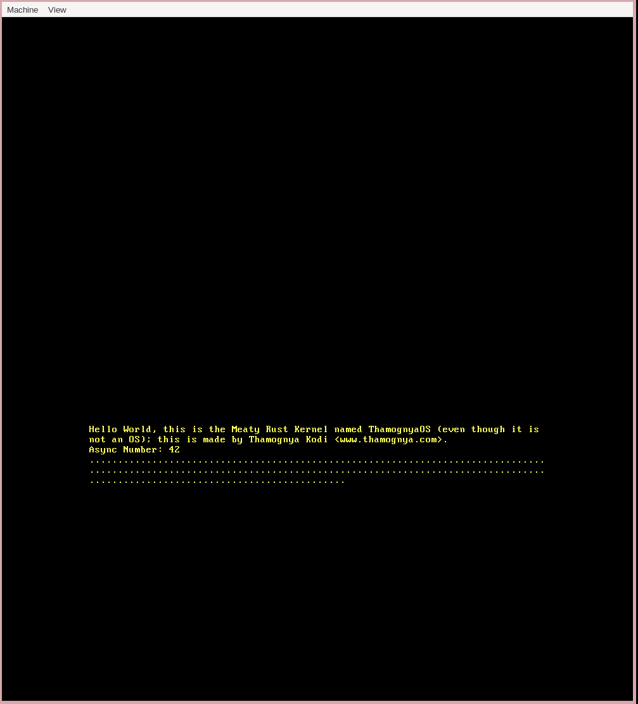

# Thamognya's Meaty Rust Kernel

This is a kernel made by me following the tutorial [blog_os](https://github.com/phil-opp/blog_os).

## Commands

To run with qemu:

```sh
cargo run
```

## Screenshots

### 1


